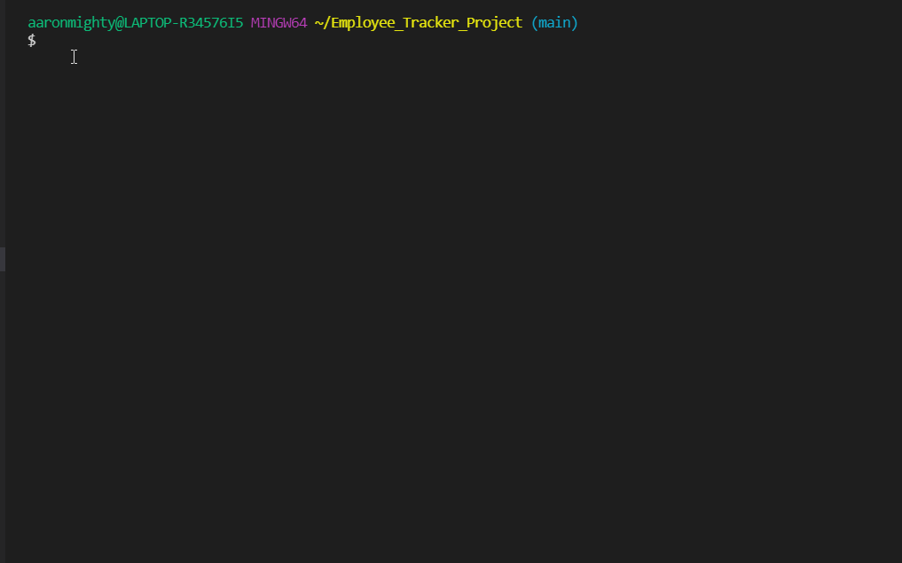
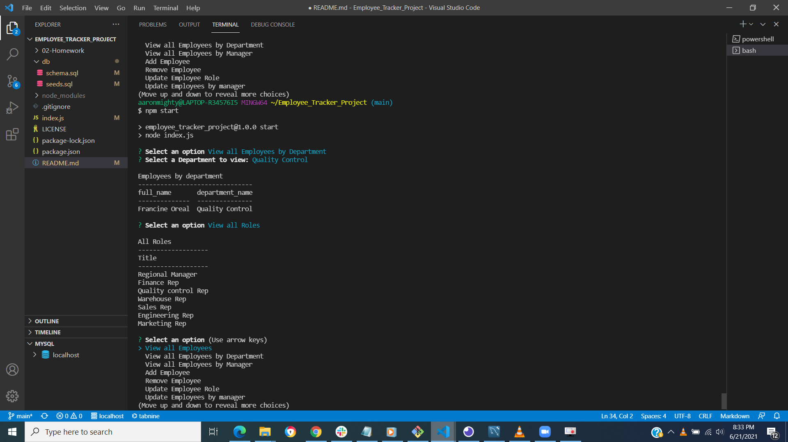
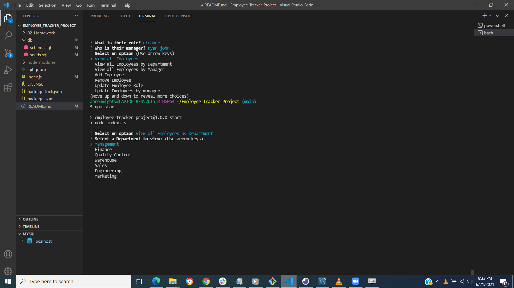
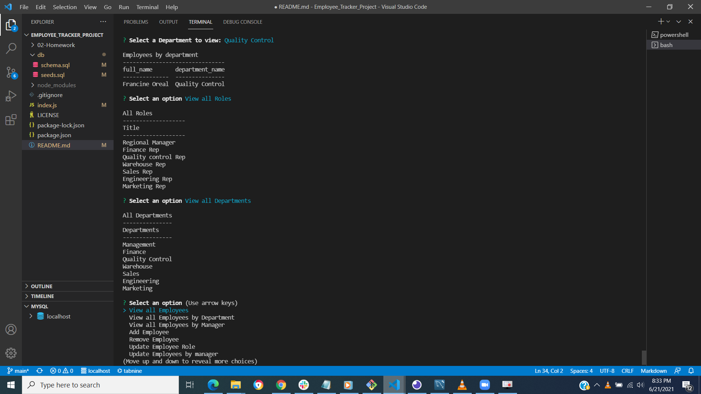

# EMPLOYEE_TRACKER_PROJECT

  # Description

  Developers are often tasked with creating interfaces that make it easy for non-developers to view and interact with information stored in databases. Often these interfaces are known as **C**ontent **M**anagement **S**ystems. In this homework assignment, the task is to build a solution for managing a company's employees.This app is command-line based that runs with Node.js using node, inquirer, and MySQL dynamically generating CMS.
 

  ## Table of Contents

  - [Description](#Description)
  - [Installation](#Installation)
  - [Usage](#Usage)
  - [Licences](#Licences)
  - [Licencesbadges](#Licencesbadges)
  - [Contributors](#Contributors)
  - [Repository Link](#Repository)
  - [GitHub Info](#GitHub) 
  
  
  ## Installation
  
  Steps required to install this project and how to get the content management system running: To generate your CMS first run npm install in order to install the following npm package dependencies as specified in the package.json: 
  * Use the [MySQL](https://www.npmjs.com/package/mysql) NPM package to connect to your MySQL database and perform queries.

  * Use [InquirerJs](https://www.npmjs.com/package/inquirer/v/0.2.3) NPM package to interact with the user via the command-line.
  * Use [ASCII-art Logo](https://www.npmjs.com/package/asciiart-logo/v/0.2.3) NPM package to interact with the user via the command-line.

  * Use [cons ole.table](https://www.npmjs.com/package/console.table) to print MySQL rows to the console. There is a built-in version of `console.table`, but the NPM package formats the data a little better for our purposes.
  inquirer,sql,console.table, logo-asciiart.The application itself can be invoked with npm start.
  
  ## Usage
  
  the following is walkthrough video and explanation:
  

  

  

  
  
  ## credits

  © 2021 Trilogy Education Services, LLC, a 2U, Inc. brand. Confidential and Proprietary. All Rights Reserved.

  ## licences

  Apache license 2.0

  ## Licencesbadges

  https://img.shields.io/badge/License-MPL%202.0-brightgreen.svg

  ## Contributors
  
  anyone is welcome to contribute to this project
  
  ## Repository
  
  - [Project Repo](github.com/aaron-might/Employee_Tracker_Project)
  
  ## GitHub
  
  ,
  
  -,
  